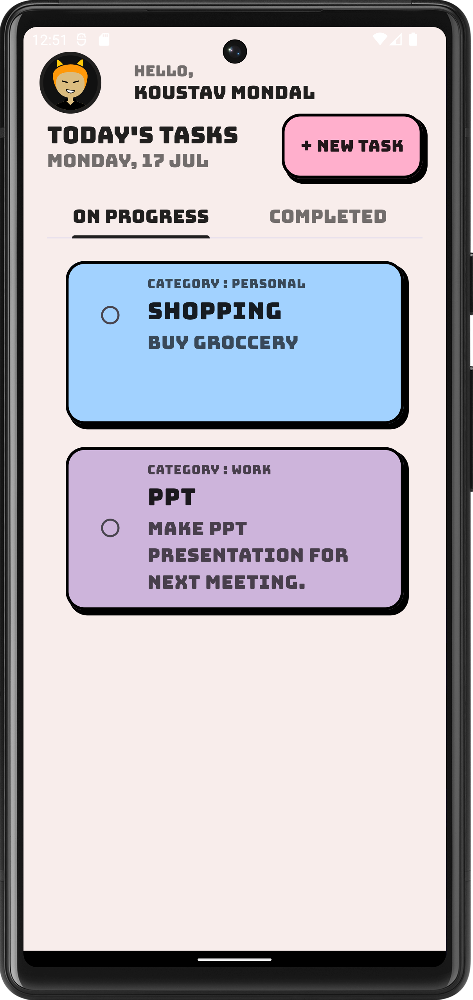
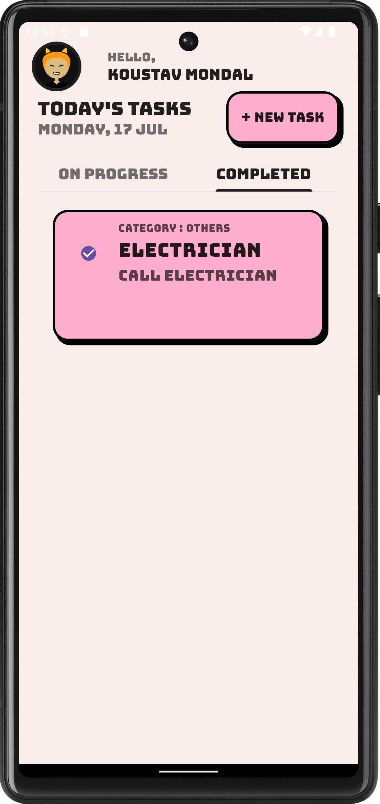
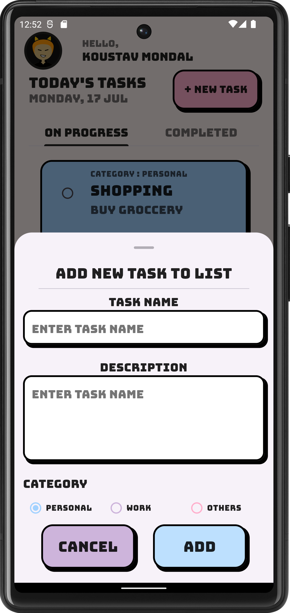

# 📅 TaskBit

It is a TODO Application that allows you to create tasks, as well as to mark them as
completed or not. It also allows you to create categories to organize your tasks.

## 👨‍💻 Tech Stack


## 📸 Screenshots

<details>
  <summary style="font-weight: bold">On Progress Screen</summary>
  
</details>
<br>
<details>
  <summary style="font-weight: bold">Completed Screen</summary>
  
</details>
<br>
<details>
  <summary style="font-weight: bold">Add Task Screen</summary>
  
</details>

## ⚙ How to run the application

1. Clone the repository
    ```shell
    git clone https://github.com/XxThunderBlastxX/taskbit.git
    ```

2. Copy the `.env.example` file to `.env` and fill the required fields

    ```shell
    cp .env.example .env
    ```

3. Get the flutter packages

    ```shell
    flutter pub get
    ```

4. Run the application

    ```shell
    flutter run -d <mobile-device-name>
    ```

> **Note:** To get appwrite instance you can follow [this](https://appwrite.io/docs/getting-started)
> guide.

## 🙍‍♂️ Author

- 👦 [ThunderBlast](https://github.com/XxThunderBlastxX)

## 📃 Licence

Copyright © 2023 [ThunderBlast](https://github.com/xXThunderBlastxX).<br />
This project is [MIT](LICENCE) licensed.
